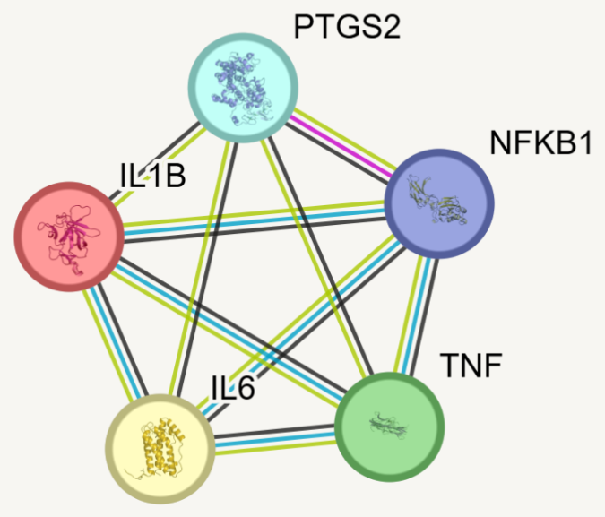
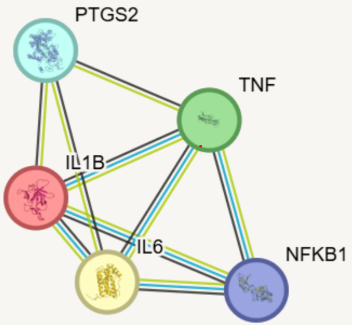
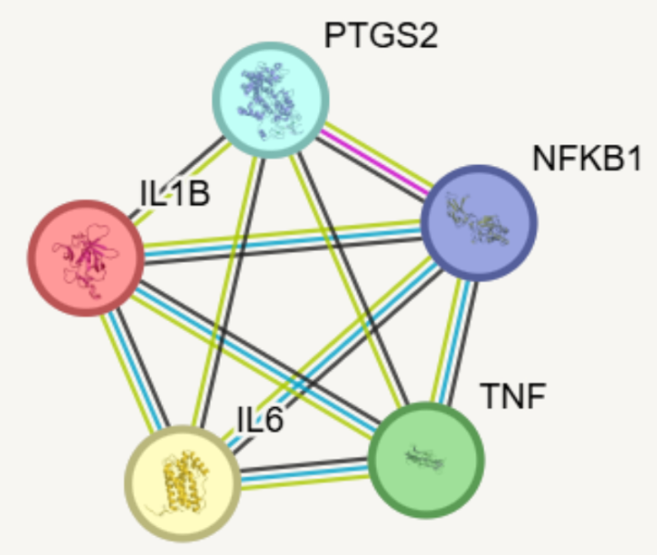
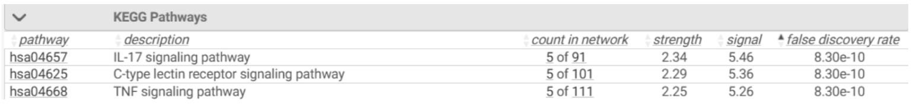
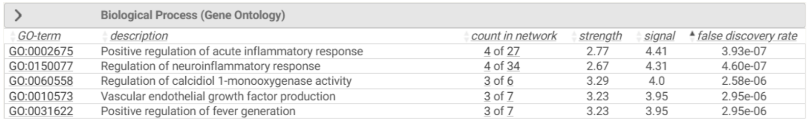
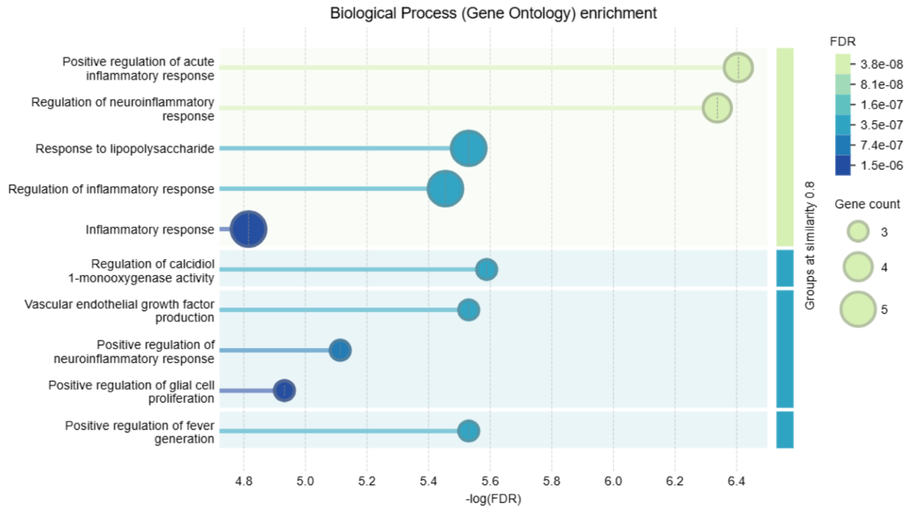

# **Ejercicios del Trabajo Práctico N°3: Interacción Proteína - Proteína**
## **Ejercicio 1: Contrucción y Visualización de la Red PPI**
### a. Topología de la red y "degree"

  

La topología de la red es densa, ya que con 5 nodos presenta las 10 interacciones posibles, está completamente conectada. Cada proteína tiene degree 4, lo que indica que todos los nodos están conectados entre sí. 

### b. Proteínas "Hub"

Se identifican 5 proteínas hub, ya que todas presentan el degree máximo de la red (4) y están conectadas con todas las demás.

### c. ¿Cómo afecta el ajuste de confianza a la red? ¿Por qué es importante este filtro?

Actualmente esta el filtro en medium confidence (0.4)

Con highest confidence (0.9): 

  

Con low confidence (0.15):

  

Vemos que con low confidence y medium confidence no cambió nada, lo cual tiene sentido ya que la red ya estaba completamente conectada con 0,4. Eso significa que para esos 5 genes todas las interacciones visibles ya superaron el umbral medio. Con mayor confianza (0.9) se pierden conexiones, no están todos los nodos conectados. Visualmente la red sigue siendo densa pero ya no es completa. Vemos que desaparece la conexión entre PTGS2 y NFKB1, lo que hace que estos bajen a degree 3. Esto indica que varias asociaciones entre las proteínas analizadas están fuertemente respaldadas (porque al aumentar el filtro de nivel de confianza siguen estando) pero no todas alcanzan el máximo nivel de confianza.  

Este filtro es importante porque permite controlar la rigurosidad de la red. Sirve para reducir ruido en la red, evitando falsos positivos y permite quedarnos únicamente con las interacciones con mayor respaldo. 

## **Ejercicio 2: Análisis de Enriquecimiento Funcional**
### a. Las 3 vías KEGG más enriquecidas (nombre y valor FDR).

### b. ¿Qué procesos biológicos aparecen? ¿Coinciden con contexto de cáncer?

El análisis de enriquecimiento funcional revela que las proteínas estudiadas participan principalmente en procesos biológicos vinculados a la respuesta inflamatoria y la regulación inmune. Entre los procesos más relevantes se destacan la regulación de la respuesta inflamatoria aguda, la respuesta neuroinflamatoria, la regulación de la actividad enzimática asociada a ciclooxigenasas (COX), la generación de fiebre y la producción de factores de crecimiento como VEGF, involucrados en la angiogénesis.

Estos resultados son coherentes con el contexto del cáncer. La inflamación crónica es un factor ampliamente reconocido en la promoción de la tumorogénesis, ya que contribuye a la proliferación celular, la supervivencia tumoral y la evasión del sistema inmune. Asimismo, la producción de VEGF desempeña un rol clave en la angiogénesis, proceso esencial para el crecimiento y la diseminación tumoral. Por otro lado, la actividad de las ciclooxigenasas y la consecuente producción de prostaglandinas también se asocian con mecanismos pro-tumorales.

### c. ¿Existen en la red proteínas que puedan ser targets combinatorios para una terapia más efectiva?

La identificación de targets combinatorios se infiere a partir del análisis conjunto de las vías enriquecidas (KEGG) y la red de interacciones. En este caso, las 5 proteínas de nuestra red se encuentran presentes en las siguientes vías, o que sugiere que podrían ser abordadas de manera combinada en estrategias terapéuticas:
- IL-17 signaling pathway	
- TNF signaling pathway
- C-type lectin receptor signaling pathway
- Human cytomegalovirus infection
- Alzheimer disease

### d. Según GO Molecular Function ¿hay actividades o dominios específicos que sean aprovechables para diseñar inhibidores o activadores?

- Dominios de quinasa (MAPK14/p38): muy drogables, existen inhibidores clínicos
- Dominio de unión a DNA (RELA, NFKB1, STAT3): se pueden bloquear con pequeñas moléculas o péptidos
- Sitio activo enzimático (PTGS2): inhibición directa con AINEs o inhibidores selectivos de COX-2
- Dominio extracelular de citoquinas (IL1B, IL6, TNF): blanco de anticuerpos monoclonales ya aprobados

## **Ejercicio 3: Identificación y Priorización de Dianas**

Tabla de evaluación para 2 candidatos:

| Criterio                     | Candidato 1                                                                 | Candidato 2                                                                 |
|----------------------------|------------------------------------------------------------------------------|------------------------------------------------------------------------------|
| Posición en red            | Hub central: conectada con NFKB1, IL1B, IL6, TNF, PTGS2. Alta betweenness centrality | Nodo conector: enlaza señales upstream (TLR4) con efectores downstream (IL1B, IL6, TNF) |
| Evidencia en enfermedad    | Sobreactivada en linfomas, cáncer de mama, colon y pulmón; promueve proliferación y evasión inmune | Implicada en inflamación crónica tumoral, metástasis y resistencia a quimioterapia |
| Drogabilidad               | Moderada: es un factor de transcripción (más difícil de inhibir), pero existen inhibidores de su activación (IKK inhibitors) y de su unión al DNA | Alta: quinasa con sitio ATP bien definido; múltiples inhibidores de p38 en ensayos clínicos (ej. losmapimod, doramapimod) |
| Participación en vías clave| IL-17 signaling, TNF signaling, C-type lectin receptor signaling            | IL-17 signaling, TNF signaling, MAPK signaling pathway                       |

### a. Justifique la elección de sus 2 candidatos.

Candidato 1: RELA (p65, subunidad de NF-κB) RELA es la subunidad efectora principal del complejo NF-κB. En la red, actúa como un hub transcripcional: regula directamente la expresión de IL1B, IL6, TNF, CXCL8 y PTGS2. Su posición en la red la convierte en un nodo con altísima centralidad, ya que su activación sostiene toda la cascada inflamatoria. Está ampliamente documentada en cáncer (linfomas, cáncer de mama, colon, pulmón) y existen moléculas en desarrollo que bloquean su translocación nuclear o su unión al DNA.

Candidato 2: MAPK14 (p38 MAPK) MAPK14 es una quinasa de señalización clave que integra señales de estrés e inflamación, fosforilando factores que activan la producción de citoquinas (IL1B, IL6, TNF). Su dominio de quinasa la hace altamente drogable con inhibidores de molécula pequeña. Está implicada en inflamación crónica asociada a tumores y en resistencia a quimioterapia.

### b. Seleccione UNO como diana principal y explique su decisión.

Se selecciona MAPK14 como diana principal:
- Drogabilidad superior: Al ser una quinasa, posee un sitio de unión a ATP estructuralmente bien definido y conservado. Esto la convierte en uno de los blancos más accesibles para el diseño de inhibidores de molécula pequeña, a diferencia de RELA, que como factor de transcripción es considerada históricamente "undruggable" con fármacos convencionales.
- Posición estratégica en la red: MAPK14 actúa como nodo integrador: recibe señales de TLR4 y las traduce en producción de IL1B, IL6 y TNF. Inhibir MAPK14 equivale a cortar múltiples ramas de la cascada inflamatoria de forma simultánea, logrando un efecto pleiotrópico sin necesidad de bloquear cada citoquina por separado.
- Evidencia clínica acumulada: Existen inhibidores de p38 MAPK evaluados en ensayos clínicos en enfermedades inflamatorias y oncológicas, lo que valida el blanco y acorta el camino hacia aplicaciones terapéuticas reales.

RELA también sería un excelente candidato para una estrategia combinatoria junto a MAPK14, dado que ambas convergen en la regulación de las mismas citoquinas desde distintos niveles de la señalización.
